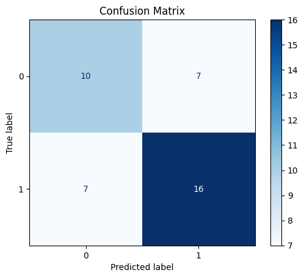
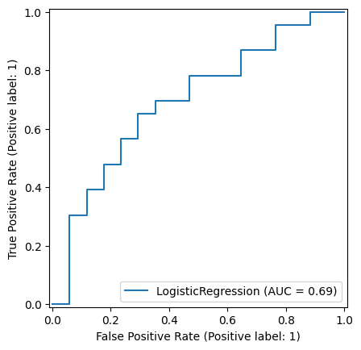

# Loan Repayment Prediction using Logistic Regression


---

## Project Overview

This project demonstrates the implementation of **Logistic Regression** to predict whether a customer is likely to repay a loan based on historical customer information.

While studying **Regression algorithms** in Machine Learning, I learned about both **Linear Regression** and **Logistic Regression**. After completing a project using **Linear Regression**, I wanted to strengthen my understanding of Logistic Regression by applying it to a real-world binary classification problem.

This project was created as part of my Machine Learning learning journey, allowing me to gain practical experience in building, evaluating, and interpreting a classification model.

---

## Project Objective

The objective of this project is to:

- Predict whether a customer will repay a loan.
- Apply Logistic Regression to a real-world classification problem.
- Practice the complete Machine Learning workflow.
- Evaluate model performance using multiple evaluation metrics.
- Generate predictions for unseen customer data.

---

## Technologies Used

- Python
- Pandas
- NumPy
- Matplotlib
- Scikit-learn
- Jupyter Notebook

---

## Project Workflow

The project follows the complete Machine Learning pipeline:

1. Import required libraries
2. Load the dataset
3. Explore and understand the data
4. Handle missing values
5. Encode categorical variables using One-Hot Encoding
6. Split the dataset into training and testing sets
7. Train a Logistic Regression model
8. Evaluate model performance
9. Predict loan repayment for unseen customers
10. Export prediction results

---

## Model Evaluation

The Logistic Regression model was evaluated using:

- Accuracy Score
- Classification Report
- Confusion Matrix
- ROC Curve
- Feature Importance Analysis

**Model Accuracy:** **65%**

Although the model achieved moderate accuracy, this project focuses on understanding the complete implementation of Logistic Regression rather than maximizing predictive performance.

---

# Project Visualizations

## Confusion Matrix

The confusion matrix shows the number of correct and incorrect predictions made by the model.

<p align="center">
  
</p>

---

## ROC Curve

The ROC Curve illustrates the model's ability to distinguish between customers who are likely and unlikely to repay their loans.

<p align="center">
  
</p>

---

## Feature Importance

The feature importance plot displays the contribution of each feature to the Logistic Regression model.

<p align="center">
  
</p>

---

## Repository Structure

```
Loan-Repayment-Prediction/
│
├── README.md
├── requirements.txt
├── LICENSE
├── .gitignore
│
├── data/
│   ├── Loan_Repayment_Training_Data.csv
│   ├── Loan_Repayment_Test_Data_NoLabel.csv
│   └── README.md
│
├── notebook/
│   ├── Loan_Repayment.ipynb
│   └── README.md
│
├── output/
│   ├── Loan_Repayment_Logistic_Regression.csv
│   └── README.md
│
└── images/
    ├── confusion_matrix.png
    ├── roc_curve.png
    ├── feature_importance.png
    └── README.md
```

---

## Installation

Clone this repository:

```bash
git clone https://github.com/your-username/Loan-Repayment-Prediction.git
```

Navigate to the project folder:

```bash
cd Loan-Repayment-Prediction
```

Install the required dependencies:

```bash
pip install -r requirements.txt
```

---

## Running the Project

Open the notebook:

```
notebook/Loan_Repayment.ipynb
```

Run all cells from top to bottom.

The notebook will:

- Train the Logistic Regression model
- Evaluate model performance
- Generate predictions
- Save the prediction results in the **output/** folder

---

## Future Improvements

Some possible improvements for this project include:

- Feature Engineering
- Hyperparameter Tuning
- Cross Validation
- Comparing Logistic Regression with Decision Tree and Random Forest
- Testing ensemble learning methods
- Improving prediction accuracy through feature selection

---

## Learning Outcome

Through this project, I gained practical experience in:

- Binary Classification
- Logistic Regression
- Data Preprocessing
- One-Hot Encoding
- Train-Test Splitting
- Model Evaluation
- ROC Curve Analysis
- Feature Importance Interpretation
- Prediction on unseen datasets

This project strengthened my understanding of how Logistic Regression can be applied to solve real-world classification problems.

---

## Author

**Bhupesh**

Aspiring Financial Analyst | Machine Learning Enthusiast

Currently building projects in Data Analytics, Machine Learning, SQL, Python, Power BI, Tableau, and Financial Analytics.
